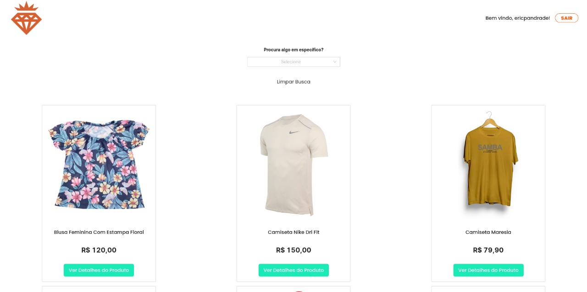

<link rel="preconnect" href="https://fonts.googleapis.com">
<link rel="preconnect" href="https://fonts.gstatic.com" crossorigin>
<link href="https://fonts.googleapis.com/css2?family=Poppins:wght@700&display=swap" rel="stylesheet">

# Vanguarda Shop

<span style="font-family: 'Poppins', sans-serif;font-size:9pt">
Criação de um site utilizando uma Mock Api com o JSON Server.
Utilização dos Conceitos:
<br />
• Requisição HTTP com Axios (GET)
<br />
• Hooks
<br /> 
• Propriedades (Props) 
<br />• Context API 
<br />• Use Params
<br />• Componentização 
<br />• Responsividade para todas as telas 
<br />• Statefull e Stateless 
<br />• Navegação com React-Router-Dom 
<br />• Ciclo de vida <br />
• PersistedState (Hook para permanência do Local Storage)
</span>

<br/>
<br/>

## Demo

<span style="font-family: 'Poppins', sans-serif;font-size:9pt">

Você pode acompanhar o site pelo Link: https://vanguarda-shop-ericpandrade.vercel.app/

</span>

<br/>

## Installation

<span style="font-family: 'Poppins', sans-serif;font-size:9pt">
Install my-project with npm
</span>

```bash
  npm install my-project
  cd my-project
```

## Run Locally

<span style="font-family: 'Poppins', sans-serif;font-size:9pt">
Clone the project
</span>

```bash
  git clone https://link-to-project
```

<span style="font-family: 'Poppins', sans-serif;font-size:9pt">
Go to the project directory
</span>

```bash
  cd my-project
```

<span style="font-family: 'Poppins', sans-serif;font-size:9pt">
Install dependencies
</span>

```bash
  npm install
```

<span style="font-family: 'Poppins', sans-serif;font-size:9pt">
Start the server
</span>

```bash
  npm run server -> Inicializa a Mock Api.
  npm run start -> Inicializa o FrontEnd.
```

<br />
<br />

 <span style="font-family: 'Poppins', sans-serif;font-size:20pt"> Designs<span>

<br />





<br/>
<br/>

## Contact

<div> 
  <a href = "mailto:ericpandrade085@gmail.com"></a>
  <a href="https://www.linkedin.com/in/eric-andrade-872a01210/" target="_blank"></a> 
  <a href="https://api.whatsapp.com/send?phone=+5585989828188&text=Olá! Gostaria de entrar em contato." target="_blank"></a>
</div>

<span style="font-family: 'Poppins', sans-serif;font-size:9pt; font-style:italic">
Projeto feito por Eric Pereira Andrade.
</span>
